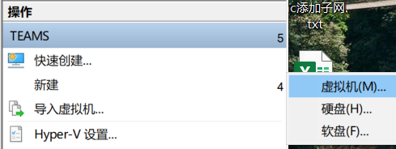
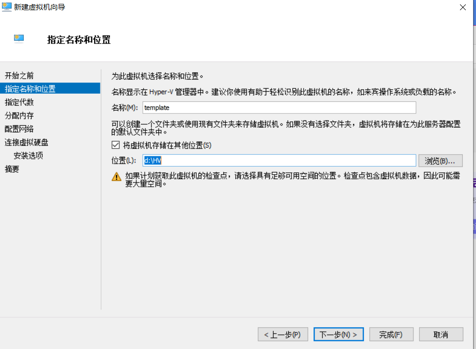
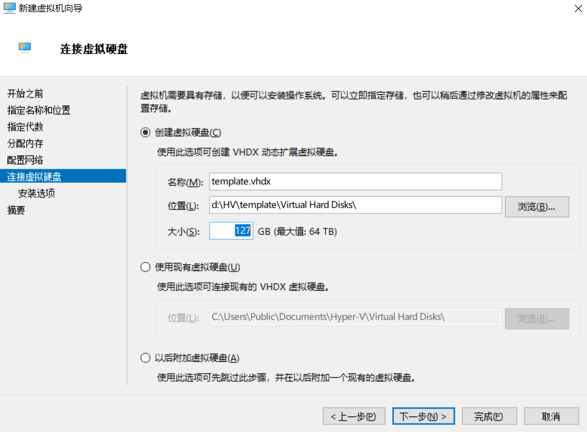
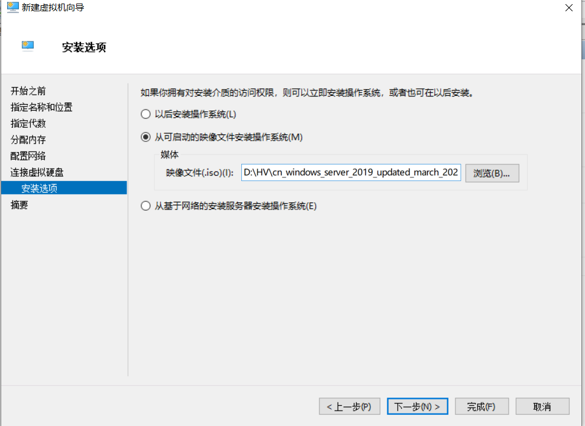
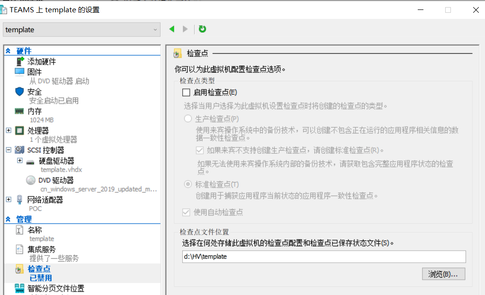
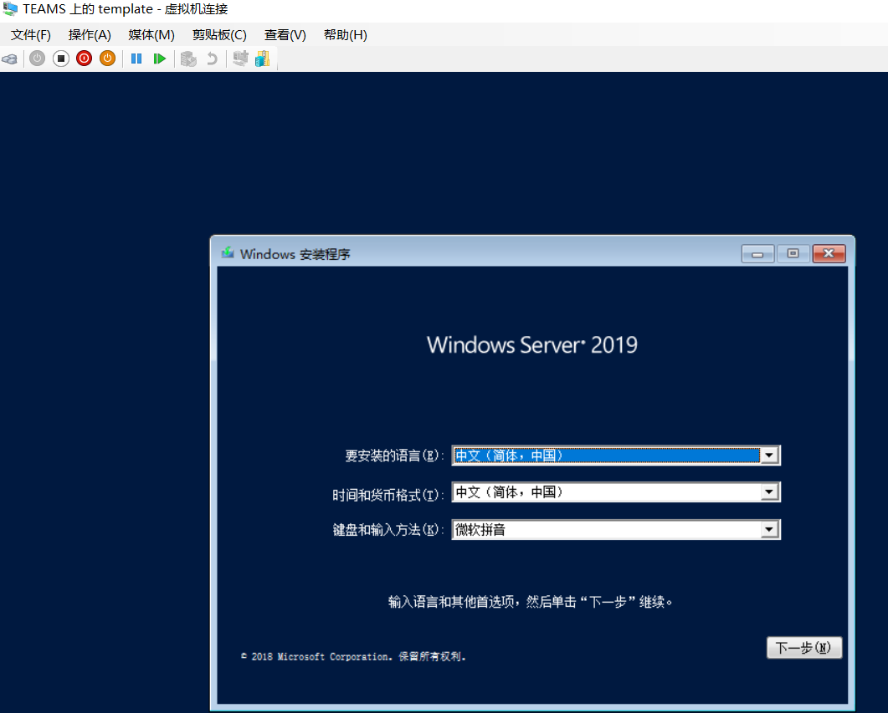
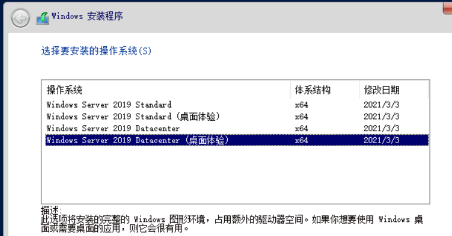
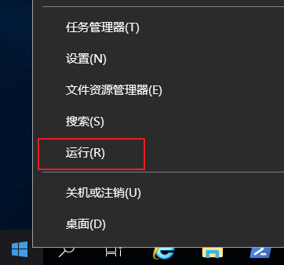
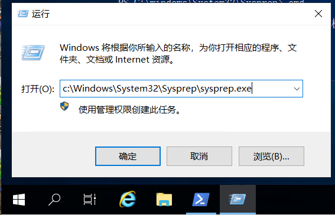
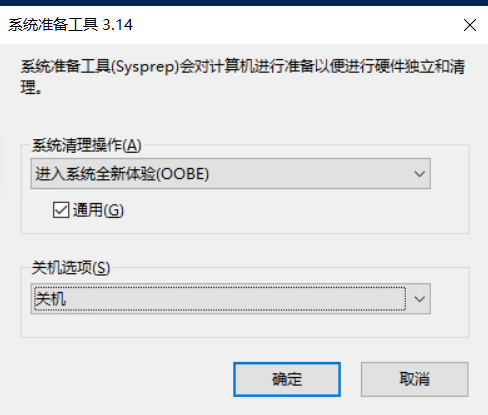

# 第一台虚拟机

为了后续快速部署，需要先创建一台虚拟机，并将其配置为模板，以便于接下来节省时间。生成的VHDX文件可以在POC过程中反复复用。

## 初次创建

在`Hyper-V管理器`中，于右侧操作区域，依次点击`新建→虚拟机`，打开创建虚拟机向导。

一直点击下一步，直至出现如下界面，配置`名称`以及`路径`，如图所示。磁盘路径可根据本机实际磁盘位置而定，点击“下一步”继续。

接下来进行如下配置：

指定代数页面，选择`第二代`，点击“下一步”继续。

分配内存页面，启动内存输入`2048`，反向取消掉`为此虚拟机启用动态内存`，点击“下一步”继续。

配置网络页面，选择创建的`POC`交换机，点击“下一步”继续。

来到连接虚拟硬盘页面，此处根据POC环境的`实际硬盘`大小来定，最低不能低于15G，硬盘空间紧张的情况下，建议分配15到30G。点击“下一步”继续。本例使用`15G`.

来到安装选项页面，选择`从可启动的映像文件安装操作系统`，通过`浏览`，加载准备好的`Windows Server 2019`介质。点击“下一步”继续。
下载试用版的地址：https://www.microsoft.com/en-US/evalcenter/evaluate-windows-server-2019?filetype=ISO

点击`完成`结束配置。

## sysprep准备

在`Hyper-V管理器`中，右键选中虚拟机，点击`设置`，找到`检查点`，取消掉`启用检查点`，如图所示。

> 注意：Windows 10上会自动开启`自动检查点`功能，未来创建其他虚拟机时，这个功能需要关闭。

回到`Hyper-V管理器`,点击`启动`。接下来`双击`该虚拟机，进入到控制台界面，进行正常的系统安装即可。

为了便于后续操作，请选择`....桌面体验`的选项，如下图所示。

 

## sysprep

具体安装过程不表，第一次进入系统后，在左下角的Winows标志处右键点击，选择运行

输入`c:\Windows\System32\Sysprep\sysprep.exe`并点击确定。

在弹出的窗口中进行如下配置，并点击确定。

- 进入系统全新体验
- 勾选`通用`
- 选择关机

耐心等待操作完成，操作系统会自动关机

## 检查 

正常情况虚拟机会自动关机，切记不可以再次开启。

由于近两年的Windows Server 2019介质开始集成月度补丁，经过测试，部分集成补丁的介质不能做sysprep，解决方法就是更换一份介质（更往前一个月）
